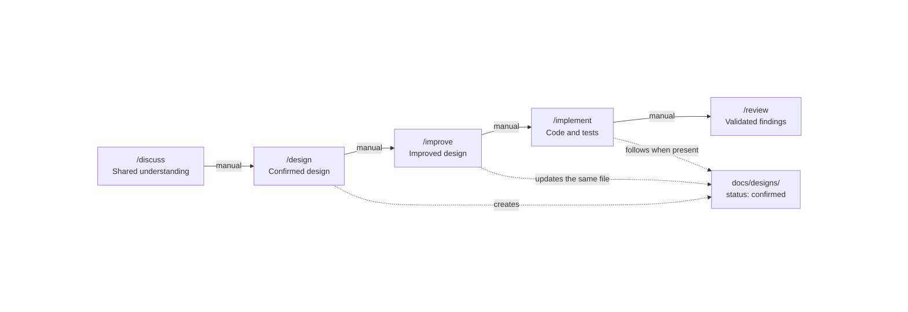

# Agent Development Workflow

A portable set of five [Agent Skills](https://agentskills.io/) for moving a software change from an unclear request to an independently reviewed implementation.

Each phase has a separate responsibility and is intentionally user-invoked. Skills never start one another automatically. A skill stops at its own completion gate; the user decides whether to continue, repeat, or skip a phase. Some phases still consume earlier artifacts: `/improve`, for example, requires a confirmed design.

## Architecture



The arrows show the full workflow, not a required pipeline. A small, clear change can start at `/implement`; a design can go directly from `/design` to `/implement`; a high-risk change can use all five phases.

## Skills

| Skill | Responsibility | Workspace effect | Completion gate |
| --- | --- | --- | --- |
| [`discuss`](skills/discuss/SKILL.md) | Investigate facts and resolve product intent, scope, constraints, and high-level direction one decision at a time. | Read-only. | The user confirms the shared understanding and no material product decision remains open. |
| [`design`](skills/design/SKILL.md) | Turn clear requirements and real repository evidence into an implementation-ready design. | Creates a dated Markdown design using the bundled [template](skills/design/templates/design.md). | The user confirms the design and its status becomes `confirmed`. |
| [`improve`](skills/improve/SKILL.md) | Independently challenge a confirmed design, validate useful suggestions, and simplify or strengthen it. | Updates the same design file only when a material improvement is found. | The improved design is reconfirmed, or the confirmed design is left unchanged when no improvement survives validation. |
| [`implement`](skills/implement/SKILL.md) | Produce the smallest correct production change, behavioral tests, and proportionate verification. | Modifies task-related production, test, generated, or directly affected documentation files. | Requirements and any confirmed design are satisfied with reported verification evidence. |
| [`review`](skills/review/SKILL.md) | Perform one independent, read-only, defect-first review of a specific change. | Read-only. | The complete target is covered and only evidence-backed findings and material verification gaps are reported. |

All five skills use `disable-model-invocation: true`. They do not automatically invoke one another, commit, push, open pull requests, or merge changes.

## Typical paths

```text
Small, clear change:       /implement -> /review
Clear feature:            /design -> /implement -> /review
Important or unclear work: /discuss -> /design -> /improve -> /implement -> /review
```

`/discuss`, `/design`, and `/improve` include explicit user-confirmation gates. `/implement` and `/review` stop after reporting their result, so fixes and re-reviews always begin as new user-invoked phases.

## Repository layout

```text
.
├── .github/workflows/validate.yml
├── docs/
│   ├── discuss Skill Specification.md
│   ├── design Skill Specification.md
│   ├── improve Skill Specification.md
│   ├── implement Skill Specification.md
│   └── review Skill Specification.md
├── scripts/
│   └── validate_skills.py
├── skills/
│   ├── discuss/SKILL.md
│   ├── design/
│   │   ├── SKILL.md
│   │   └── templates/design.md
│   ├── improve/SKILL.md
│   ├── implement/SKILL.md
│   └── review/SKILL.md
├── LICENSE
└── README.md
```

Each skill lives in its own directory under `skills/`. Supporting files exist only when the workflow needs them; currently only `/design` needs a template.

## Installation

From the root of a cloned copy of this repository, install the skills for the current user with:

```sh
mkdir -p ~/.agents/skills
cp -R skills/discuss skills/design skills/improve skills/implement skills/review ~/.agents/skills/
```

For a repository-scoped installation, replace `/path/to/project` with the target repository:

```sh
mkdir -p /path/to/project/.agents/skills
cp -R skills/discuss skills/design skills/improve skills/implement skills/review /path/to/project/.agents/skills/
```

The specifications use slash names such as `/discuss`. Invoke the installed skill with the syntax supported by your agent; for example, Codex uses `$discuss`, `$design`, `$improve`, `$implement`, and `$review`.

## Validation

Run the same validation used by CI:

```sh
python3 scripts/validate_skills.py
```

The validator checks every directory under `skills/` for a valid name, matching `SKILL.md` frontmatter, a bounded description, and non-empty instructions.

## License

Licensed under the [MIT License](LICENSE).
