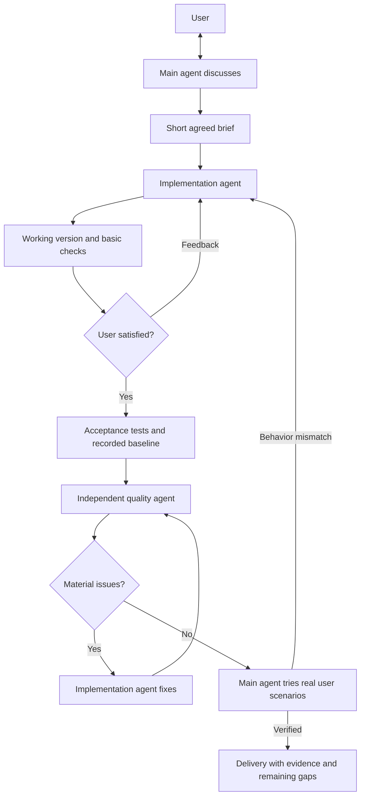

# Agent Development Workflow

Delegate outcomes to capable agents. Keep prompts short, iterate with the user, and let executable checks provide evidence.

One [workflow skill](skills/workflow/SKILL.md) coordinates discussion, implementation, independent quality checks, and real-user acceptance.

## How it works


```mermaid
flowchart TD
    U[User] <--> M[Main agent discusses]
    M --> B[Short agreed brief]
    B --> I[Implementation agent]
    I --> F[Working version and basic checks]
    F --> A{User satisfied?}
    A -->|Feedback| I
    A -->|Yes| L[Acceptance tests and recorded baseline]
    L --> Q[Independent quality agent]
    Q --> R{Material issues?}
    R -->|Yes| X[Implementation agent fixes]
    X --> Q
    R -->|No| V[Main agent tries real user scenarios]
    V -->|Behavior mismatch| I
    V -->|Verified| E[Delivery with evidence and remaining gaps]
```

### Core Roles & Ownership

- **Main Agent**: Owns the discussion, delegation, scope boundaries, feedback coordination, and final acceptance.
- **Implementation Agent**: Owns technical decisions, code changes, and bug fixes.
- **Quality Agent**: Performs independent code review and deterministic checks (CRAP and mutation testing).
- **Rule**: Start subagents with fresh contexts where supported. Reuse the implementer across feedback and repairs. Never run multiple writers against the same files concurrently.

The skill's [SKILL.md](skills/workflow/SKILL.md) defines the full process: run sizing, the five stages, and their completion criteria. Role references under [`skills/workflow/references/`](skills/workflow/references/) hold what each subagent needs.

---

## Install and use

```sh
npx skills add itzLan1126/Workflow
```

Add `--global` for a user-wide installation. Use your client's explicit invocation syntax, for example:

```text
$workflow Help me make the export flow easier to use.
$workflow Implement the agreed brief at docs/tasks/export.md.
```

### Operational Guardrails

- **Explicit Invocation**: Preserves the repository's explicit-only invocation policy. Delegates short role references on demand instead of loading all role instructions into the main agent at once.
- **Minimal Context**: Pass only the brief, relevant paths, the review target, and concise results. Retain full logs outside the conversation and inspect them only when needed.
- **Safe Permissions**: Workflow invocation permits local implementation and repairs once authorized. It does _not_ authorize commits, pushes, pull requests, publishing, destructive operations, or production access without explicit user approval.
- **Existing Docs**: Existing design documents remain useful context and can serve as briefs without converting their status fields.

---

## Repository validation

```sh
python3 -m venv .venv
.venv/bin/python -m pip install -r requirements-dev.txt
.venv/bin/python -m unittest discover -s tests
.venv/bin/python scripts/validation.py
```

### Self-Quality Verification

- **CRAP Check**:

  ```sh
  .venv/bin/python scripts/self_crap.py
  ```

  Runs the test suite under branch coverage, keeps coverage data, LCOV, measurements, and config in a fresh temporary directory, and prints its path for evidence. Exits 0 only when current measurements meet the standard. The threshold comparison uses exact rational arithmetic, even when a displayed score rounds to 6. Configs containing `maxCrap` are rejected so old per-project limits cannot apply silently. Read its JSON output for exact counts and per-function scores.

- **Mutation Check**:

  ```sh
  .venv/bin/python scripts/self_mutation.py
  ```

  Builds a fresh analysis copy in a temporary directory containing all seven bundled scripts (including the Lizard/LCOV collector and mutation report renderer) and imports them under their real module names for test association. Entrypoint smoke tests and the nested real-mutmut integration test are excluded from the inner run. Actionable mutants (survivors, uncovered, timeouts, errors) are grouped by function with IDs, numbered `-`/`+` diffs, status counts, exit code, and the original report path; add `--json` for summary fields plus `mutants` and `reportPath`. Presentation never alters the gate or counts timeouts as kills. Survivors and timeouts require investigation; pytest internal errors must remain errors. A nonzero result is not a pass; do not reuse historical survivor counts or assume equivalence.

- **Platform Support & Windows Job Cleanup**:
  The Windows runner holds a bootstrap behind a pipe until it is assigned to a kill-on-close Job Object, then releases the tool ([job helper](skills/workflow/scripts/windows_job.py)); the tool and all descendants inherit that job. Cleanup owns the job rather than looking up a possibly exited root PID, and timeout failures keep their timeout classification even if cleanup reports an error. Native timeout and root-exit cleanup behavior is verified in Windows CI; Linux self-tests exercise API contracts. Bundled scripts require Python 3.10+.

- **Deterministic Repository CI**:
  The validator and CI check skill packaging, YAML frontmatter, references, README consistency, and explicit invocation policies. These are deterministic checks of this repository, not proof that an agent host implements the workflow correctly or that a target application meets requirements.

---

## License

[MIT](LICENSE).

## Design references

The lightweight dependency-based implementation approach draws on Matt Pocock's [to-tickets](https://github.com/mattpocock/skills/blob/main/skills/engineering/to-tickets/SKILL.md) and [implement-spec](https://github.com/mattpocock/skills/blob/main/skills/engineering/implement-spec/SKILL.md): independently verifiable slices, explicit blockers, concurrent ready work, and sparse context pointers. It does not require their tracker, publishing, or commit workflow.
