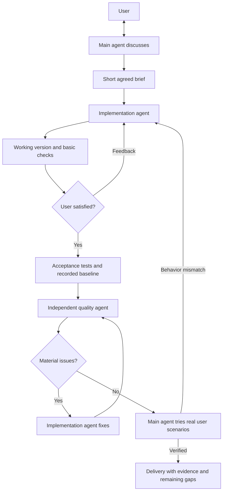

# Agent Development Workflow

Delegate outcomes to capable agents. Keep prompts short, iterate with the user, and let executable checks provide evidence.

One [workflow skill](skills/workflow/SKILL.md) coordinates discussion, implementation, independent quality checks, and real-user acceptance. It replaces the former `discuss`, `design`, `improve`, `implement`, and `review` skills.

## How it works


```mermaid
flowchart TD
    U[User] <--> M[Main agent discusses]
    M --> B[Short agreed brief]
    B --> I[Implementation agent]
    I --> F[Working version and basic checks]
    F --> A{User satisfied?}
    A -->|Feedback| I
    A -->|Yes| L[Acceptance tests and recorded baseline]
    L --> Q[Independent quality agent]
    Q --> R{Material issues?}
    R -->|Yes| X[Implementation agent fixes]
    X --> Q
    R -->|No| V[Main agent tries real user scenarios]
    V -->|Behavior mismatch| I
    V -->|Verified| E[Delivery with evidence and remaining gaps]
```

### Core Roles & Ownership

- **Main Agent**: Owns the discussion, delegation, scope boundaries, feedback coordination, and final acceptance.
- **Implementation Agent**: Owns technical decisions, code changes, and bug fixes.
- **Quality Agent**: Performs independent code review and deterministic checks (CRAP and mutation testing).
- **Rule**: Start subagents with fresh contexts where supported. Reuse the implementer across feedback and repairs. Never run multiple writers against the same files concurrently.

---

### Right-size the run

Match workflow depth to the task before starting, and state the chosen depth so the user can change it:

- **Trivial** (typos, renames, single obvious fix): Skip discovery. Confirm a one-paragraph brief inline. Run conventional review; skip CRAP and mutation testing (say so explicitly). Personally verify the result.
- **Logic-free** (docs, copy, configuration, styling): Discuss only if direction is unclear. Run conventional review only; report CRAP and mutation testing as not applicable.
- **Standard / Complex**: Follow the full 5-stage workflow below.

When in doubt, propose a depth and let the user choose. Escalate if the work turns out larger than expected.

---

### The 5 Workflow Stages

#### 1. Discuss and hand off

- **Investigate & Advise**: The main agent holds the discussion directly, as this context is essential for final acceptance. Investigate facts directly; delegate only bulky background research. Offer at least 3 distinct options with tradeoffs, your recommendation, and welcome another answer. Respectfully challenge assumptions when evidence supports a better direction.
- **Keep Repo Clean**: Keep project code untouched during discussion. Disposable prototypes, mockups, and UI comparisons live in an external temporary or chat directory outside the repository. Label prototypes as illustrative and state their assumptions.
- **Write a Short Brief**: Summarize the problem, desired outcomes, relevant context, constraints, decisions with reasons, and open questions. Put critical information first. There is no mandatory template, file-by-file plan, or draft/confirmed/completed state machine.
- **Handoff**: Save the brief in an agreed project directory (e.g., `docs/tasks/`) without overwriting unrelated work. When the user authorizes implementation, proceed. An already agreed brief can skip discovery and go straight to implementation.
- _Host limitations_: When the host cannot delegate to subagents, follow [host compatibility](skills/workflow/references/host-compatibility.md).

#### 2. Build, show, and revise

- **Scale Execution**: Handle small tasks with a single implementer. Split large tasks into demonstrable end-to-end slices with explicit dependencies. Run ready, independent slices concurrently with clear write ownership; sequence overlapping edits or use isolated worktrees so agents never overwrite each other's work.
- **Continuous Checks**: Run basic checks throughout: relevant tests, build and type checks, and proactive safeguards against regressions, data loss, and security issues.
- **Show Early**: The implementation lead integrates and verifies the whole user experience before presenting a testable version. Report how to try the result, actual check results, and what is not yet verified.
- **Iterate on Feedback**: Continue revising until the user explicitly accepts the behavior. Reuse relevant implementers to preserve context. Silence, passing tests, and the agent's own confidence do not count as acceptance. Update the brief only when goals or constraints change. Defer the expensive quality pass until user acceptance.

#### 3. Lock in acceptance

Once the user explicitly accepts the behavior:

- **Automate Scenarios**: The implementer turns the scenarios the user tried into automated acceptance or regression tests where practical (without changing accepted behavior), and lists remaining manual scenarios.
- **Snapshot Baseline**: The main agent records the accepted baseline as a saved patch (including untracked files) or a commit if the user authorizes one. Add both to the brief's evidence. All subsequent quality repairs are compared against this baseline to ensure behavior does not change.

#### 4. Check quality and repair

- **Step 1 - Conventional Review**: An independent quality agent reviews the full change and affected callers against the brief. Verify actionable defects; do not manufacture style issues. The implementer fixes substantiated findings and the quality agent rechecks them before running deterministic tools.
- **Step 2 - Deterministic Quality Checks**: Follow the [CRAP and mutation tool guide](skills/workflow/references/quality-tools.md):
  - **CRAP Standard**: Every function must meet CRAP ≤ 6, aggregate line coverage ≥ 95%, and aggregate branch coverage ≥ 90%.
  - **Mutation Testing**: Run real language-specific mutation engines scoped to changed code by default (using engine diff or file filters).
  - **Environment**: Execute mutation testing in an isolated disposable copy containing the exact accepted changes (including uncommitted files). The runner does not install dependencies or create this copy automatically.
  - **Integrity**: Missing tools, stale or empty reports, and command failures cannot produce a pass. Surviving mutants require investigation; some are equivalent. Never weaken assertions, exclusions, or thresholds merely to obtain a pass.
- **Repair Loop**: The main agent validates findings and sends them to the implementer, then verifies repairs against the accepted baseline. Repairs must keep acceptance tests green. If checks are blocked or the loop stalls without progress, report evidence and wait for the user's decision. User-accepted gaps remain unverified. Behavior-changing proposals return to the user.

#### 5. Try it as a user

- **Direct Acceptance**: The main agent runs automated acceptance tests, then directly exercises remaining manual scenarios via the actual UI, CLI, or API (including meaningful error and recovery paths).
- **Inspect Evidence**: Read the brief and inspect real evidence; do not rely solely on subagent completion claims or quality scores.
- **Handle Mismatches**: Return behavioral mismatches to implementation. Recheck affected quality evidence after fixes; return to user feedback if accepted behavior changes.
- **Delivery**: Completion requires actual verification evidence for each key user outcome in the brief. Deliver the outcome, checks actually performed, and material gaps. Unavailable runtime access or user-accepted gaps remain unverified.

---

## Install and use

```sh
npx skills add itzLan1126/Workflow
```

Add `--global` for a user-wide installation. Use your client's explicit invocation syntax, for example:

```text
$workflow Help me make the export flow easier to use.
$workflow Implement the agreed brief at docs/tasks/export.md.
```

### Operational Guardrails

- **Explicit Invocation**: Preserves the repository's explicit-only invocation policy. Delegates short role references on demand instead of loading all role instructions into the main agent at once.
- **Minimal Context**: Pass only the brief, relevant paths, the review target, and concise results. Retain full logs outside the conversation and inspect them only when needed.
- **Safe Permissions**: Workflow invocation permits local implementation and repairs once authorized. It does _not_ authorize commits, pushes, pull requests, publishing, destructive operations, or production access without explicit user approval.
- **Migration & Existing Docs**: Existing design documents remain useful context and can serve as briefs without converting their status fields. If migrating from older versions, delete any leftover legacy skill folders (`discuss`, `design`, `improve`, `implement`, `review`).

---

## Repository validation

```sh
python3 -m venv .venv
.venv/bin/python -m pip install -r requirements-dev.txt
.venv/bin/python -m unittest discover -s tests
.venv/bin/python scripts/validation.py
```

### Self-Quality Verification

- **CRAP Check**:

  ```sh
  .venv/bin/python scripts/self_crap.py
  ```

  Runs the test suite under branch coverage, keeps coverage data, LCOV, measurements, and config in a fresh temporary directory, and prints its path for evidence. Exits 0 only when current measurements meet the standard. The threshold comparison uses exact rational arithmetic, even when a displayed score rounds to 6. Read its JSON output for exact counts and per-function scores.

- **Mutation Check**:

  ```sh
  .venv/bin/python scripts/self_mutation.py
  ```

  Builds a fresh analysis copy in a temporary directory containing all seven bundled scripts (including the Lizard/LCOV collector and mutation report renderer) and imports them under their real module names for test association. Entrypoint smoke tests and the nested real-mutmut integration test are excluded from the inner run. Actionable mutants are grouped by function with numbered diffs and summary; add `--json` for machine-readable output. Survivors and timeouts require investigation; pytest internal errors must remain errors. A nonzero result is not a pass; do not reuse historical survivor counts or assume equivalence.

- **Platform Support & Windows Job Cleanup**:
  The Windows runner assigns a gated bootstrap to a kill-on-close Job Object before releasing the tool (`scripts/windows_job.py`). Native timeout and root-exit cleanup behavior is verified in Windows CI; Linux self-tests exercise API contracts. Bundled scripts require Python 3.10+.

- **Deterministic Repository CI**:
  The validator and CI check skill packaging, YAML frontmatter, references, README consistency, and explicit invocation policies. These are deterministic checks of this repository, not proof that an agent host implements the workflow correctly or that a target application meets requirements.

---

## License

[MIT](LICENSE).

## Design references

The lightweight dependency-based implementation approach draws on Matt Pocock's [to-tickets](https://github.com/mattpocock/skills/blob/main/skills/engineering/to-tickets/SKILL.md) and [implement-spec](https://github.com/mattpocock/skills/blob/main/skills/engineering/implement-spec/SKILL.md): independently verifiable slices, explicit blockers, concurrent ready work, and sparse context pointers. It does not require their tracker, publishing, or commit workflow.
