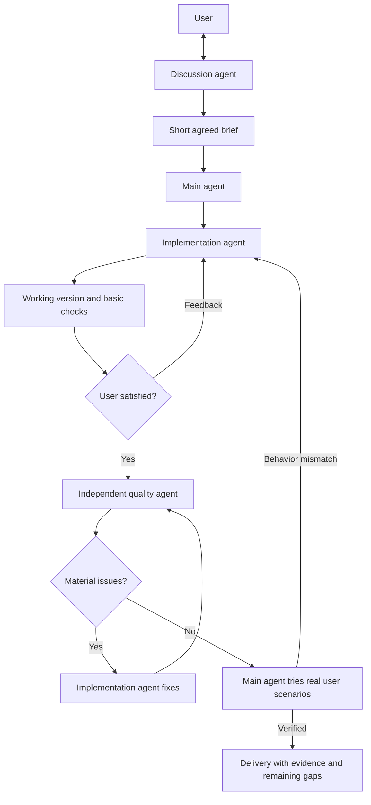

# Agent Development Workflow

Delegate outcomes to capable agents. Keep prompts short, iterate with the user, and let executable checks provide evidence.

One [workflow skill](skills/workflow/SKILL.md) coordinates discussion, implementation, independent quality checks, and real-user acceptance. It replaces the former `discuss`, `design`, `improve`, `implement`, and `review` skills.

## How it works


```mermaid
flowchart TD
    U[User] <--> D[Discussion agent]
    D --> B[Short agreed brief]
    B --> M[Main agent]
    M --> I[Implementation agent]
    I --> F[Working version and basic checks]
    F --> A{User satisfied?}
    A -->|Feedback| I
    A -->|Yes| Q[Independent quality agent]
    Q --> R{Material issues?}
    R -->|Yes| X[Implementation agent fixes]
    X --> Q
    R -->|No| V[Main agent tries real user scenarios]
    V -->|Behavior mismatch| I
    V -->|Verified| E[Delivery with evidence and remaining gaps]
```

The main agent owns delegation, scope, feedback, and final acceptance. Subagents own detailed investigation, implementation, and quality work. Use fresh subagent contexts when supported; reuse the implementer during feedback and repairs. Do not run multiple writers against the same files.

### Discuss and hand off

The discussion agent investigates facts, offers at least three meaningful choices with its own recommendation, and challenges the user when evidence supports a better direction. It may create UI comparisons or disposable prototypes outside the repository; discussion does not change project code. It then writes a short brief. Delegate as you would to a capable colleague: explain the problem, desired outcome, relevant context, constraints, and open questions. Put important information first. Preserve the reasons behind consequential decisions, not the conversation transcript.

There is no mandatory template, file-by-file plan, or draft/confirmed/completed state machine. Save the brief at an agreed project location, preferably an existing task-document directory, without overwriting unrelated work. The user reviews it and authorizes implementation; an existing agreed brief can be used directly.

**Context isolation depends on the host.** A discussion subagent needs its own user-facing conversation to keep that exchange out of the main agent's context. If unavailable, use a separate discussion chat and start an execution chat from the brief. If the user prefers one chat, relay the exchange and disclose that it does not provide full isolation. A skill cannot erase messages already received or create host capabilities. Without subagent support, report the limitation and offer separate chats or a single-agent fallback rather than claiming independent work occurred.

### Build, show, and revise

The implementation agent chooses the technical approach and scales execution to the brief. Small work stays with one agent. Large work is split into demonstrable end-to-end slices with explicit dependencies; ready independent slices run concurrently with clear write ownership. The implementation lead integrates and verifies the whole experience before presenting a version the user can try. Run basic checks throughout: relevant tests, build or type checks, and safeguards against regressions, data loss, and security problems. Report how to try the result and what is not yet verified.

Keep implementing user feedback until the user explicitly accepts the behavior. Update the brief only when the agreed outcome or constraints change. Silence, passing tests, and the agent's own confidence do not count as user acceptance. Defer the expensive quality pass until then.

### Check quality and repair

After user acceptance, an independent quality agent performs conventional code review first. Resolve and recheck material findings before running the more expensive deterministic tools. Basic tests and safety checks remain active throughout implementation.

The bundled [CRAP and mutation tool guide](skills/workflow/references/quality-tools.md) provides executable scripts, report formats, and setup instructions. CRAP combines measured per-function complexity and coverage. Mutation testing invokes a real language-specific engine and parses its report. Missing tools, stale or empty reports, and command failures cannot produce a pass. Reports include scope and gaps; scores cannot establish that the user wanted the resulting behavior.

Use the target project's justified thresholds and relevant code scope. Surviving mutants require investigation; some are equivalent. Do not weaken assertions, exclusions, or thresholds merely to obtain a pass. The runner does not install dependencies or make an isolated copy automatically; use a disposable project copy containing the exact accepted changes for mutation runs.

The main agent validates actionable findings and sends them to the implementer, then requests verification of repairs and affected behavior. Stop when material issues are resolved. If the loop repeats without progress or a required check is blocked, report the blocker and evidence rather than looping forever or declaring success. Repairs preserve the accepted behavior; behavior-changing proposals return to the user.

### Try it as a user

The main agent uses the actual UI, CLI, or API to exercise the intended outcome, including meaningful failure or recovery scenarios. Read the current brief and inspect evidence as needed; do not rely solely on a subagent's completion claim or quality scores.

A mismatch returns to implementation. Recheck affected quality evidence after fixes; return to user feedback if accepted behavior changes. Unavailable runtime access means acceptance is incomplete, not passed. Deliver the outcome, checks actually performed, and material gaps.

## Install and use

```sh
npx skills add itzLan1126/Workflow
```

Add `--global` for a user-wide installation. Use your client's explicit invocation syntax, for example:

```text
$workflow Help me make the export flow easier to use.
$workflow Implement the agreed brief at docs/tasks/export.md.
```

The entrypoint preserves the repository's explicit-only invocation policy. It delegates short role references on demand instead of loading all role instructions into the main agent. Give agents the brief, relevant paths, the review target, and concise results; retain full logs outside the conversation and inspect them only when needed.

Existing installations may retain the five old skill folders. Remove those obsolete installed copies when migrating; changing this repository does not uninstall them from a client. Existing design documents remain useful context and can serve as briefs without converting their status fields.

Invoking the workflow permits its local implementation and repair loop once implementation is authorized. It does not authorize commits, pushes, pull requests, publishing, destructive operations, or production access. Respect existing user permissions and preserve unrelated work.

## Repository validation

```sh
python3 -m venv .venv
.venv/bin/python -m pip install -r requirements-dev.txt
.venv/bin/python -m unittest discover -s tests
.venv/bin/python scripts/validation.py
```

The existing validator and CI check skill packaging, YAML, references, README consistency, and explicit invocation policies. These are deterministic checks of this repository, not proof that an agent host implements the workflow correctly or that a target application meets its requirements. CI and release validation run all script tests with Python unittest. The bundled scripts require Python 3.10+; target mutation engines retain their own runtime requirements.

## License

[MIT](LICENSE).

## Design references

The lightweight dependency-based implementation approach draws on Matt Pocock's [to-tickets](https://github.com/mattpocock/skills/blob/main/skills/engineering/to-tickets/SKILL.md) and [implement-spec](https://github.com/mattpocock/skills/blob/main/skills/engineering/implement-spec/SKILL.md): independently verifiable slices, explicit blockers, concurrent ready work, and sparse context pointers. It does not require their tracker, publishing, or commit workflow.
